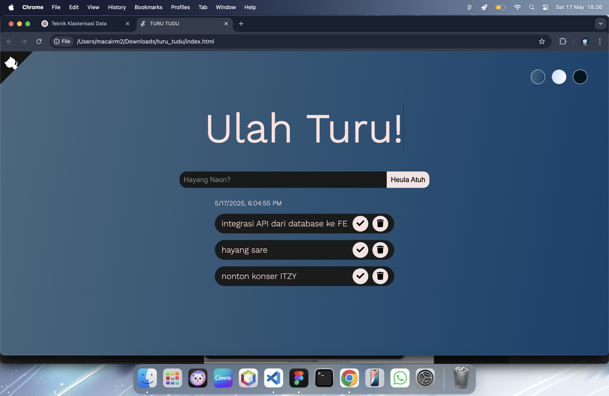
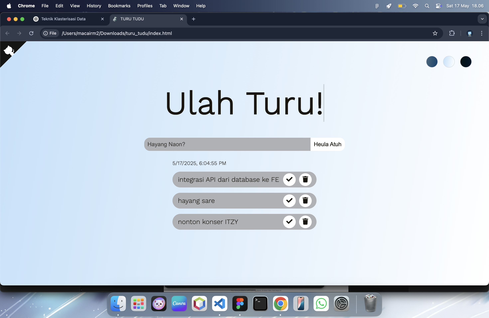
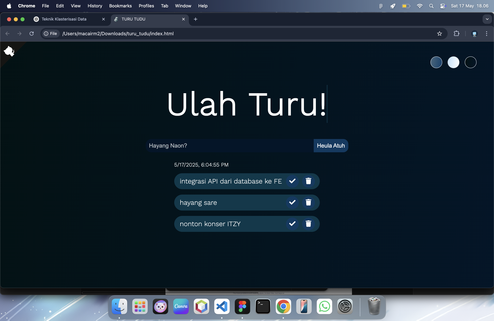

# 🌙 🐟 TURU TUDU - Ulah Turu!

**TURU TUDU** adalah aplikasi _To-Do List aesthetic_ berbasis web yang dibuat dengan **HTML**, **CSS**, dan **JavaScript (Vanilla)**.  
Aplikasi ini hadir dengan tampilan bersih dan smooth, serta dilengkapi dengan 3 mode tampilan: **Default**, **Light**, dan **Dark Mode**.  
Dengan tagline **"Ulah Turu!"** (_Bahasa Sunda untuk "Jangan Tidur!"_), aplikasi ini dirancang untuk memotivasi kamu menyelesaikan tugas harian tanpa menunda-nunda.

---

## ✨ Fitur Utama

- 🌈 **Tampilan Aesthetic** — desain elegan dengan smooth transition saat hover.
- 🌗 **3 Mode Tema** — Default, Light Mode, dan Dark Mode.
- ✅ **Tambah, Selesaikan, dan Hapus Tugas** — langsung dari satu layar utama.
- ⏰ **Penanda Waktu Otomatis** — menunjukkan waktu saat tugas dibuat.
- 🔄 **Responsive** — tampil sempurna di layar laptop dan ponsel.

---

## 🖼️ Preview Aplikasi

### 💻 Desktop Mode

  
 
 
_Tampilan default dengan latar gelap, elemen to-do berbentuk kapsul, dan ikon checklist serta delete._

---

## 🔗 Live Demo

Akses aplikasi langsung melalui link berikut:  
👉 [Demo Click Here](https://turutudu.msync.my.id)

---

## 👩‍💻 Kontributor

Dibuat oleh:

**Malika Shakila**  
- 💼 [LinkedIn](https://linkedin.com/in/malikashkl)  
- 📸 [Instagram](https://instagram.com/malikashkl)

---

## 💻 Teknologi yang Digunakan

- **HTML5** — Struktur dasar halaman
- **CSS3** — Styling dan transisi smooth
- **JavaScript Vanilla** — Logika interaktif (tanpa framework/library)

---

## 📄 Lisensi

Proyek ini dirilis di bawah lisensi MIT.  
Silakan digunakan dan dikembangkan kembali untuk kebutuhan pribadi atau edukasi.

---

## ⭐ Yuk Dukung Proyek Ini!

Jika kamu suka aplikasi ini, jangan lupa kasih ⭐ di GitHub!

---

> _"Ulah turu, waktumu berharga! Catat dan selesaikan semua tugasmu dengan TURU TUDU."_ ✨
